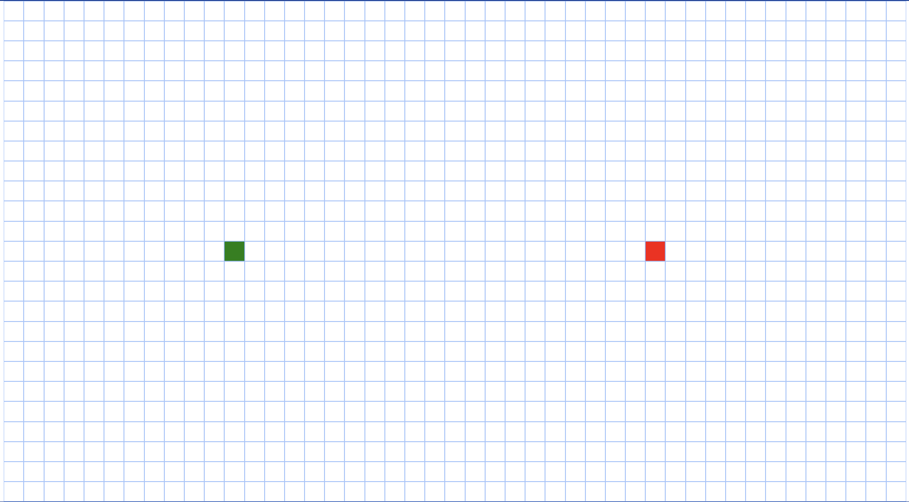

<div align="center" id="top"> 
   

&#xa0;

  <!-- <a href="https://pathfindingvisualizer2.netlify.app">Demo</a> -->
</div>

<h1 align="center">Pathfinding Visualizer</h1>

<!-- Status -->

<!-- <h4 align="center">
	🚧  Pathfindingvisualizer2 🚀 Under construction...  🚧
</h4>

<hr> -->

<p align="center">
  <a href="#dart-about">About</a> &#xa0; | &#xa0; 
  <a href="#sparkles-features">Features</a> &#xa0; | &#xa0;
  <a href="#rocket-technologies">Technologies</a> &#xa0; | &#xa0;
  <a href="#white_check_mark-requirements">Requirements</a> &#xa0; | &#xa0;
  <a href="#checkered_flag-starting">Starting</a> &#xa0; | &#xa0;
  <a href="#memo-license">License</a> &#xa0; | &#xa0;
  <a href="https://github.com/{{YOUR_GITHUB_USERNAME}}" target="_blank">Author</a>
</p>

<br>

## :dart: About

The pathfinding visualizer project is aimed at helping people who are new into graph searching algorithms understand how they work. This project uses 5 different graph/trees search algorithms to find the distance between two points.

I chose this project because I wanted to learn more about data structures and specifically graph data structures. Since I started learning web development I have always dedicated part of my time to learn work on projects and learn new skills. Therefore I chose to do a "programming related" to learn twice as much by having to researching new programming related conceps and coding.

## :sparkles: Features

:heavy_check_mark: Grid\
Here you can draw obstacles by clicking and dragging the cursor over the grid.
Unfortunately, we cannot drag the two nodes at the moment, so we need to use the
"random Pointers" feature. This is something I am working towards now.

:heavy_check_mark: Searching Algorithms\
The buttons below show the algorithms that can be used.
The algorithm starts running as soon as you click on one of them.

:heavy_check_mark: Properties\
You can also change the width and height of the grid and even the velocity of the algorithms.

:heavy_check_mark: Mazes[development] & random Pointer
Lastly, you can click on mazes and generate a default maze to test each search algorithm.


## :rocket: Technologies

The following tools were used in this project:

- [JavaScript](https://developer.mozilla.org/en-US/docs/Web/JavaScript)
- [Node.js](https://nodejs.org/en/)
- [CSS3](https://developer.mozilla.org/en-US/docs/Web/CSS)
- [HTML5](https://developer.mozilla.org/en-US/docs/Glossary/HTML5)

## :white_check_mark: Requirements

Before starting :checkered_flag:, you need to have [Git](https://git-scm.com) and [Node](https://nodejs.org/en/) installed.

## :checkered_flag: Starting

```bash
# Clone this project
$ git clone https://github.com/Davisino/pathfindingvisualizer2

# Access
$ cd Pathfinding-Visuazlier-2022-

# Install dependencies
$ npm i

# Run the project
$ node index

# The server will initialize in the <http://localhost:3000>
```

## :memo: License

This project is under license from MIT. For more details, see the [LICENSE](LICENSE.md) file.

Made with :heart: by <a href="https://github.com/Davisino" target="_blank">Davisino</a>

&#xa0;

<a href="#top">Back to top</a>
=======
# Pathfinding-Visuazlier-2022-
This is the new version of my previous pathfinding visualizer. It was built in a more structural way "in terms of code". It now has 2 new more algorithms, obstacles and a new UI with a lot of functionalities. Check it out here!  https://pathfindingvisualizer.herokuapp.com/

